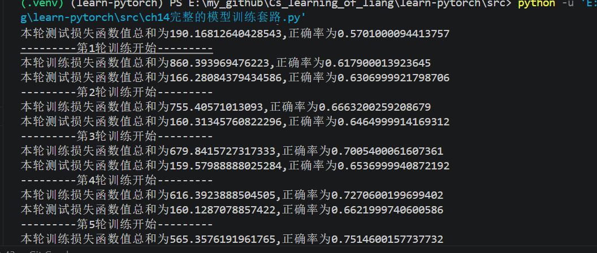
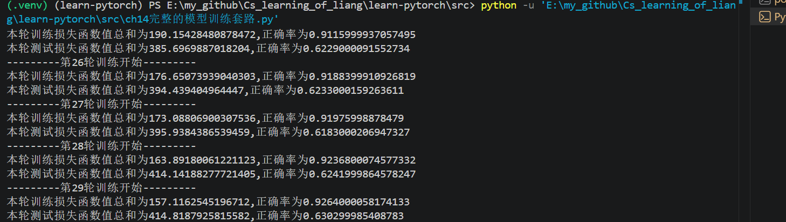
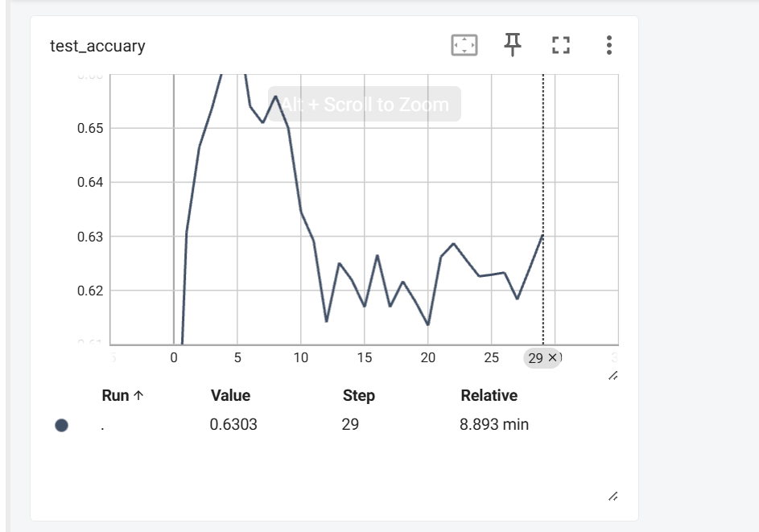
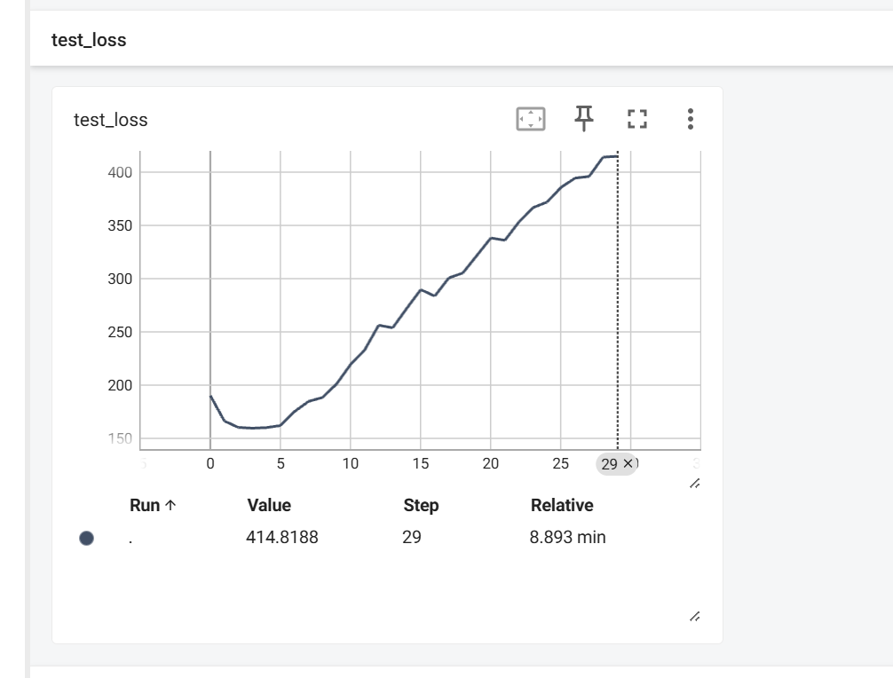
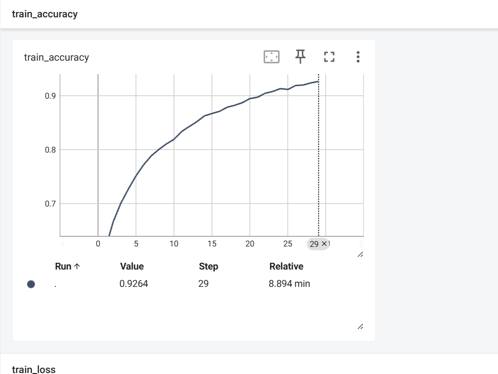
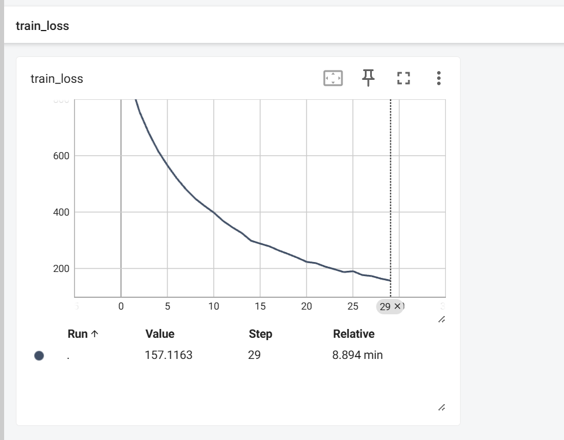
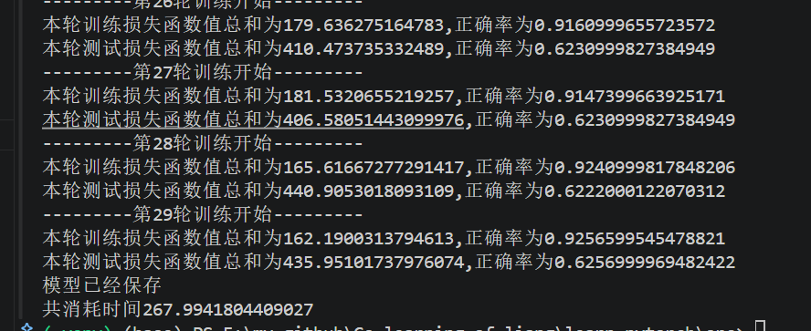

# 笔记

//todo 给出每个函数的官方文档地址

本文中得一些数据，都可以参考官方文档，之后会在每个部分给出对应官方文档地址。

//todo 介绍以下库,包括我在所有代码中用到的所有库，并且介绍库对应的功能，比如torch对张量本体计算，因而有reshape等，**torch.nn.functional**：无参数的函数版网络操作

* torch
* torchvision
* torch.nn
* torch.utils
* torchvision.transforms

//todo介绍常见函数的来源的库

## ch1pytorch加载数据.py

### dataloader作用

* 为网络提供不同数据形式

### dataset作用

* 提供一种方式获得其数据与每一种label
  * 如何获取每一种数据及其label
  * 告诉我们数据数量

### 数据集形式

* 图片名为label
* txt文件存取label

### 图像形式

* tensor
* PIL

help与??查询官方解释

## ch2 TensorBoard的使用

* 查看日志 `tensorboard --logdir=日志文件名 --port=端口名字`，端口号可以自己设置，防止跟别人一样，如果不自己设置，默认6006.
* add_image接受为numpy或者torch.tensor ，opencv处理图片可以获得numpyyix 以下为img_array=np.array(img)处理后的结果：
* **H** = **Height**，高度
* **W** = **Width**，宽度
* **C** = **Channel**，通道数
* add_graph
* add_images
* add_scalar:可以用来记录损失函数

## ch3 transforms使用

创建工具-》使用工具-》输入-》输出——》结果

* totensor
  1. 使用opencv中的imread，type : narray
  2. 使用PIL的image，type : PIL
* resize
  1. 返回PIL
  2. 对象的参数为PIL
  3. 定义对象时候的参数为，两个参数表示高宽度，一个表示高
* composer
  1. 定义对象的参数[PIL的resize函数（可以已经对象化的）,totensor函数（可以对象化）]，这是一个例子
  2. 使用对象时候参数为PIL图篇
  3. 功能：将多个对图片的操作，连接起来，按照顺序调用
  4. 方法，将PIL调用compose函数
* RandomCrop
  1. 定义对象的参数：序列（长宽）或者整形（此时为一个正方形边长）
  2. **从**原**图**中**随机**裁剪**出**一块**指定**大小**的**区域
  3. 功能：随机裁剪

## ch4 常见transforms、

* call函数，直接使用对象名（参数）即可调用
* totensor
* Normalize 归一化，参数为两个列表，分别为均值与标准差，计算后的结果为为：R = (R - 均值） / 标准差
* resize
* composer
* RandomCrop

## ch5 torchvision数据集的使用

* torchvision.datasets相当于一个数字，元素为PIL和元素对应的种类的下标

## ch6 dataloader的使用

## ch7 神经网络的骨架（骨架，卷积层，池化层）

* 使用module的对象，对象（input）自动调用forward函数
* torch.nn.functional.convnd，其中n为数量，1，2，3等，表示数据的维度
  1. stride=(line，column)，也可以就是一个整数
  2. padding只接受一个整形，直接对上下左右全部加上，或者（）,只能对称，直接对左右加上相同数，上下加上相同数
* torch.nn.convd:
* torch.nn.maxpool
  1. kernel_size
  2. ceil_mode：对于长度宽度向上还是向下取整
  3. dialation：一个池化层中取得元素得间隔

## ch8 神经网络-非线性激活

* torch.nn.Relu
  1. 参数：input (N，* )
  2. 参数：inplace 是否在原有input基础上改
  3. 输出：output(N, * )
* torch.nn.sigmod
  1. 参数
  2. 输出
* 

## ch9 神经网络-线性层及其他层介绍

//todo

//定义，比如为了达到他的目的，他是如何做的（比如正则化层通过将某一部分神经网络的输出随机变为0），参数及其用途还有参数介绍，层的用法，解释作用，具体例子

//将这些换为对应的函数

* 卷积层
* 池化层
* 正则化层（将一部分神经网络输出随机变为0，防止过拟合）
* 归一化层
* 线性层 torch.nn.lean(in_feature,out_feature,bias),bias表示是否加偏移

## ch10 sequential的神经网络搭建

named_parameters()，可以拿到每个参数的参数名以及参数值梯度值

// todo 介绍这些损失函数的参数及其计算公式，以及适用的地方

## ch11 反向传播与损失函数

下面这些损失函数的计算结果也是张量，参加了渴求到张量会自动保存计算图，便于反向传播，计算的结果直接放到grad中，需要结合优化器，之后执行梯度下降

* torch.nn.L1oss，x与y相减的绝对值取平均
  1. reduction参数的各种设置，默认为mean，可以设置为sum
* torch.MSELoss：平方差的平均
* torch.nn.CrossEntropyLoss （解决分类问题）
  1. 参数的shepe，第一个为样本数，第二个为类别数，因而不能升维度
* 反向传播：loss_result.backward（），loss_result为记录的损失函数的损失值，backward会将这个梯度记录在每一层的梯度中，单获得loss值，则loss_result.item()

## ch12 优化器

//补全以下todo中的笔记

// todo 写出以下优化器的参数，比如eps，momentum等，还有优化器的整体使用方法介绍，以及不同优化器区别以及使用场景作用等

//todo 查看梯度与权重，层.weight.data梯度，.weight.grad，偏移值层.bias，sequantial当数组一样用以上内容即可

// todo 介绍一下优化的常用函数，包括参数等及其作用，函数功能及其作用，比如zerograd清零梯度，step执行梯度下降

// model.parameter()可以直接调用所有模型参数

* torch.optim.SGD
* torch.optimAdAM

optim.zero_grad()：将梯度设置为0，因为每次step执行后，是梯度相加

optim.step():执行梯度下降

## ch13 网络模型

* torchvison.models.VGG16
  1. pretrained
  2. prosess：是否显示下载进度条

## ch14 完整模型训练套路

* vgg16_true.add_module():增加一层

  1. name
  2. module
* vgg16_false.classifier[6]=torch.nn.Linear(4096,10)：直接修改

### 方式1

* torch.save（保存模型）

  1. obj
  2. root
* torch.loader()

  1. root
  2. weight_only，取决于保存时候保存整个模型还是参数

### 方式2 保存为字典

* torch.save(obj.state_dict()),root)
  1 todo 参数介绍
* vgg16_load.load_state_dict(torch.load('../pretrained_model/vgg16_false.pth'))

  1. 定义一个被加载模型同样规格的模型
  2. 使用这个函数填充参数
  3. 这个不能用于加载位置层次的模型，只能填充参数
* Argmax找到最大值下标
* 测试前最好用类.eval()，训练前用类.train()

由下图可知，训练数据过小，存在过拟合

## ch15 使用gpu训练

网络模型-》数据-》损失函数-》.cuda（）

loss函数，神经网络对象，都有cuda，optim没有，数据dataloader没有，但是dataloader中的imgs，target有

我用的是4060，消耗时间如下，并别，你可以通过numworker改变：

.to(device)

* 用cpu device = torch.device("cpu")
* 用显卡 device = torch.device('cuda')
* 存在多个显卡 device =torch.device('cuda:0')

对应GPU上训练模型，下载到本地用cpu操作时候，需要用torch.load(root,map_location=torch.device('cpu'))
