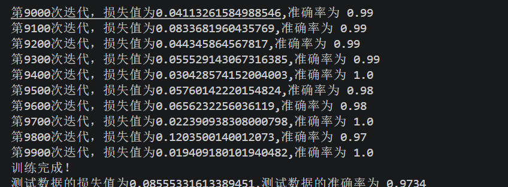

# 第五章 误差反向传播法

本目录对应《深度学习入门》中“误差反向传播法”一章。本章的关键，不只是把网络训练起来，而是建立一套统一的实现方式：把复杂网络拆成很多“层”，每一层都独立实现 `forward()` 和 `backward()`，再借助链式法则把整体梯度拼接起来。

本章对应的主要代码如下：

- `ch1简单乘加法层.py`：实现乘法层与加法层，用最基础的计算图说明反向传播。
- `ch2激活层.py`：实现 `ReluLayer` 与 `SigmoidLayer`。
- `ch3Affine以及softmax层实现.py`：实现 `AffineLayer` 和 `SoftmaxWithLoss`。
- `ch4two_layer.py`：将前面各层组装成两层神经网络，并比较数值微分与反向传播所得梯度。
- `model_two_layer.npz`：保存两层网络训练参数与训练历史。

## 本章核心思想

设损失函数为：

`L = f(g(h(x)))`

根据链式法则，有：

`dL/dx = dL/df * df/dg * dg/dh * dh/dx`

误差反向传播法的本质，就是把这条链分发到每一层中去完成：

- 每一层在前向传播时保存反向传播所需的中间量
- 每一层在反向传播时接收上游梯度 `dout`
- 每一层根据局部导数计算出本层梯度与下游梯度

这样，整个网络只需“一次前向 + 一次反向”就能得到全部参数梯度，远比对每个参数分别做数值微分快得多。

## ch1 简单乘加法层

### 实验目的

用最简单的标量计算图建立对反向传播的直觉，理解“上游梯度 × 局部导数”的基本规则。

### 实验原理

#### 1. 乘法层

若输出为：

`z = x * y`

则：

- `dz/dx = y`
- `dz/dy = x`

因此反向传播时：

- `dx = dout * y`
- `dy = dout * x`

这就是 `MultiplyLayer.backward()` 的来源。

#### 2. 加法层

若输出为：

`z = x + y`

则：

- `dz/dx = 1`
- `dz/dy = 1`

所以：

- `dx = dout`
- `dy = dout`

这就是 `AddLayer.backward()` 的数学依据。

### 实验现象及原因分析

本文件中使用“苹果价格”和“苹果加橘子总价”两个例子进行验证。前向传播用于算总价，反向传播用于算每个输入对总价的影响程度。这个例子说明：

- 局部求导往往很简单
- 整体复杂计算可以拆成很多局部层
- 只要局部层的前向和反向都正确，整体梯度就能正确传播

## ch2 激活层

### 实验目的

理解激活函数为什么不仅要参与前向传播，也必须参与反向传播。

### 实验原理

#### 1. ReLU 层

ReLU 定义为：

`relu(x) = max(0, x)`

其导数为：

- `1`，当 `x > 0`
- `0`，当 `x <= 0`

因此 ReLU 在前向传播时要记录哪些位置被截断，反向传播时再将这些位置梯度清零。当前代码中用 `mask` 完成这一任务。

#### 2. Sigmoid 层

sigmoid 定义为：

`sigmoid(x) = 1 / (1 + exp(-x))`

其导数可以写成：

`sigmoid'(x) = sigmoid(x) * (1 - sigmoid(x))`

因此只要前向传播保存了输出 `out`，反向传播就可以直接写成：

`dx = dout * out * (1 - out)`

### 实验现象及原因分析

这一节虽然没有复杂图像实验，但非常关键，因为它说明：

- 激活层没有参数，但依然会改变梯度流向
- 若激活层的 `backward()` 写错，整个网络梯度都会跟着出错
- “是否有参数”和“是否参与反向传播”是两个不同问题

## ch3 Affine 层与 SoftmaxWithLoss 层

### 实验目的

实现神经网络中最重要的两类层：

- 线性变换层 `AffineLayer`
- 输出损失层 `SoftmaxWithLoss`

### 实验原理

#### 1. Affine 层

前向传播：

`out = xW + b`

反向传播：

- `dx = dout * W^T`
- `dW = x^T * dout`
- `db = sum(dout, axis=0)`

其中：

- `dx` 传给前一层
- `dW`、`db` 用来更新本层参数

#### 2. SoftmaxWithLoss 层

该层将 softmax 和交叉熵损失合在一起处理。对于 one-hot 标签，反向传播可以化简为：

`dx = (y - t) / batch_size`

其中：

- `y` 为 softmax 概率输出
- `t` 为真实标签

组合后梯度大幅简化，因此在实现中通常将 softmax 与 loss 合并为一个层。

### 实验现象及原因分析

实现好这两层后，网络已经具备了真正的训练骨架：

- `AffineLayer` 负责参数变换与参数梯度
- `SoftmaxWithLoss` 负责把输出变成损失，并把误差信号传回来

从这一步开始，网络就不再只是“做前向预测”，而是真正能够参与梯度学习。

### 结合当前代码的备注

当前 `SoftmaxWithLoss.backward()` 已经为了后续章节的权值衰减实验保留了扩展接口。但从第五章主线来看，最需要掌握的仍然是：

- 前向保存 `y` 和 `t`
- 反向得到主梯度 `(y - t) / batch_size`

也就是说，本章重点仍是“误差如何从损失层向前传播”。

## ch4 两层神经网络与梯度验证

### 实验目的

把前面实现的各层组合成完整的两层神经网络，并通过数值微分验证反向传播的正确性。

### 网络结构

当前两层网络结构为：

`Affine1 -> ReLU1 -> Affine2 -> SoftmaxWithLoss`

### 实验原理

#### 1. 数值微分

数值微分通过给参数一个极小扰动，近似计算损失函数对参数的变化率。  
优点是实现简单、概念直观；缺点是计算非常慢，而且容易受到数值精度影响。

#### 2. 反向传播

反向传播利用链式法则，一次前向、一次反向即可得到全部参数梯度，效率远高于数值微分。

#### 3. 梯度验证

因为反向传播实现容易在符号、维度或广播上出错，所以常见做法是：

1. 用数值微分求梯度
2. 用反向传播求梯度
3. 比较二者误差是否足够小

当前 `test()` 函数正是在完成这个过程。

### 为什么当前代码使用较小初始化

当前两层网络中使用了如下初始化：

```python
weight_init_std = 0.01
self.params['W1'] = weight_init_std * np.random.randn(input_size, hidden_size)
self.params['b1'] = np.zeros(hidden_size)
self.params['W2'] = weight_init_std * np.random.randn(hidden_size, output_size)
self.params['b2'] = np.zeros(output_size)
```

这样做的原因是：如果初始权重过大，softmax 输出可能非常极端，交叉熵损失在局部区域会变得数值不稳定，数值微分看到的损失变化可能过小或过于粗糙，进而影响梯度验证。

因此，在做“数值微分 vs 反向传播”对比时，较温和的初始化更容易得到可靠结果。

### 实验结果



### 实验现象及原因分析

- 梯度验证通过，说明各层 `backward()` 的实现基本正确。
- 训练过程中损失下降、准确率提升，说明反向传播已经真正支撑起了一个可训练的神经网络。
- 当前代码加入了 `model_two_layer.npz` 的保存与恢复逻辑，因此训练可以中断后继续进行。

### 结合当前代码的实现说明

1. `sync_layer_params()`

   层对象内部也保存了 `W` 和 `b` 的引用，因此当外部 `params` 被替换或加载时，需要同步回各层。

2. `test()`

   这是本章最关键的练习之一。它把“数值微分正确”和“反向传播正确”联系起来，是检验实现是否可靠的重要手段。

3. `model_two_layer.npz`

   当前训练脚本会优先读取旧模型继续训练，因此若要完全复现实验，最好先确认是否需要删除旧模型或改名保存。

## 本章方法在实践中的使用时机

这一部分用于补充说明：本章出现的“层”和“方法”在真实神经网络中通常什么时候使用、要达到什么效果。

### 1. MultiplyLayer / AddLayer 什么时候用

这两个层主要是教学用途，用来帮助理解计算图和链式法则。  
在实际深度学习代码中，通常不会专门把普通加法和乘法都单独写成层，但它们的思想会保留在自动求导框架底层。

达到的效果：

- 帮助理解梯度从哪里来
- 帮助理解“局部导数 × 上游梯度”

### 2. ReLU 什么时候用

ReLU 是隐藏层中最常用的激活函数之一，通常用于：

- 全连接层之后
- 卷积层之后
- 需要较快训练、较少梯度消失的场景

达到的效果：

- 引入非线性
- 使网络能拟合复杂函数
- 相比 sigmoid，通常训练更快

### 3. Sigmoid 什么时候用

Sigmoid 在隐藏层中现在用得比 ReLU 少，但依然常见于：

- 二分类输出层
- 需要将值压到 `(0, 1)` 区间的场景
- 门控结构，如后续更复杂网络中的门控单元

达到的效果：

- 把输出转为概率意义的数值
- 适合做“是否属于某一类”的判断

### 4. AffineLayer 什么时候用

AffineLayer 就是全连接层，适合用在：

- MLP 中的主干线性映射
- 卷积网络末端的分类头
- 从高维特征映射到分类结果的场景

达到的效果：

- 让网络学会线性组合与特征变换
- 为后续激活函数和输出层提供可学习表示

### 5. SoftmaxWithLoss 什么时候用

SoftmaxWithLoss 主要用于多分类任务，通常作为网络最后一层使用。

达到的效果：

- 把输出分数转换为类别概率
- 结合交叉熵直接得到损失
- 在反向传播时提供简洁而稳定的输出层梯度

若是二分类任务，则常见做法是 `sigmoid + binary cross entropy`；若是回归任务，则不使用 softmax。

### 6. 数值微分什么时候用

数值微分通常不用来真正训练网络，因为太慢。  
它最适合用在：

- 新层刚写完时做梯度检查
- 怀疑反向传播实现有 bug 时做验证

达到的效果：

- 提供一个相对可靠的“参考答案”
- 帮助定位反向传播实现错误

### 7. 反向传播什么时候用

只要网络中存在可学习参数，并且要基于梯度优化参数，就需要用反向传播。  
它是现代神经网络训练的基础方法，几乎所有深度学习模型都离不开它。

达到的效果：

- 高效计算全部参数梯度
- 支撑大规模网络训练
- 为后续的正则化、BN、Dropout 等技巧提供计算基础

## 与后续章节的衔接

第五章解决的是“梯度怎么高效算出来”的问题。  
而第六章进一步讨论的是“梯度算出来以后，怎样让网络学得更快、更稳、更不容易过拟合”。

因此两章的关系可以概括为：

- 第五章：解决“能不能训练”
- 第六章：解决“怎样训练得更好”

例如：

- 没有反向传播，就无法高效实现权值衰减
- 没有反向传播，就无法训练带有 Batch Normalization 的网络
- 没有反向传播，Dropout 也无法在训练时正确处理梯度传播

## 本章总结

第五章的重点不是某一个具体网络，而是一种统一的实现方式：

- 把神经网络拆成层
- 每层独立实现 `forward()` 和 `backward()`
- 用链式法则把梯度在层间传递起来

完成这一章后，神经网络的训练就从“依赖缓慢的数值微分”走向了“依赖高效的误差反向传播法”。  
这也为后续实现更深网络、正则化、Batch Normalization 和 Dropout 打下了直接基础。
