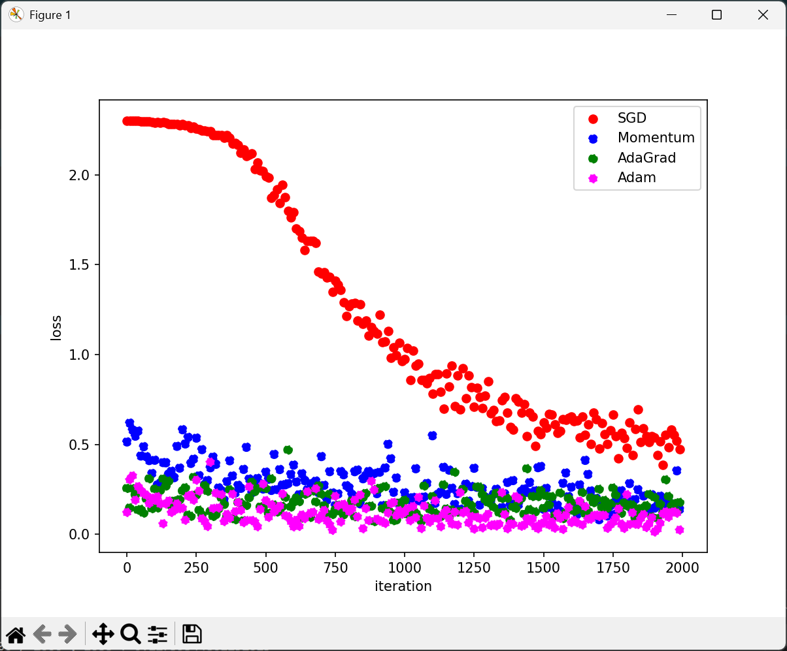
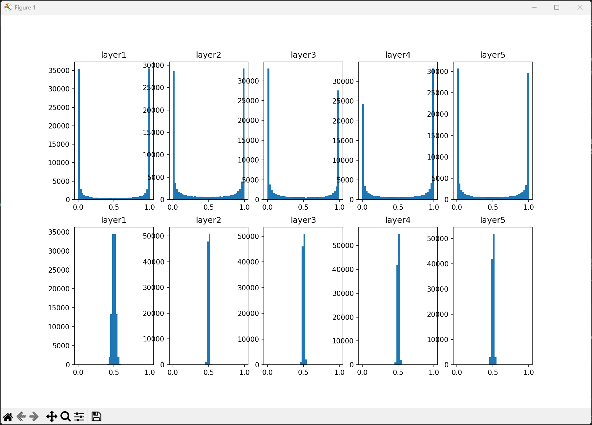
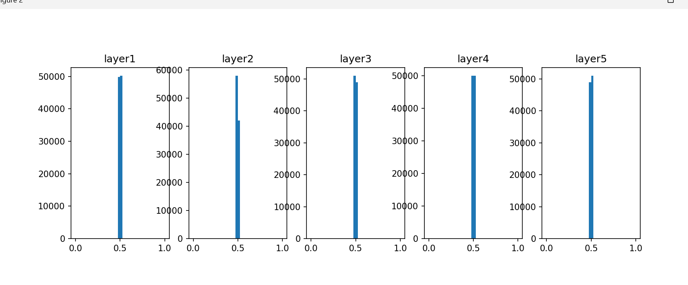
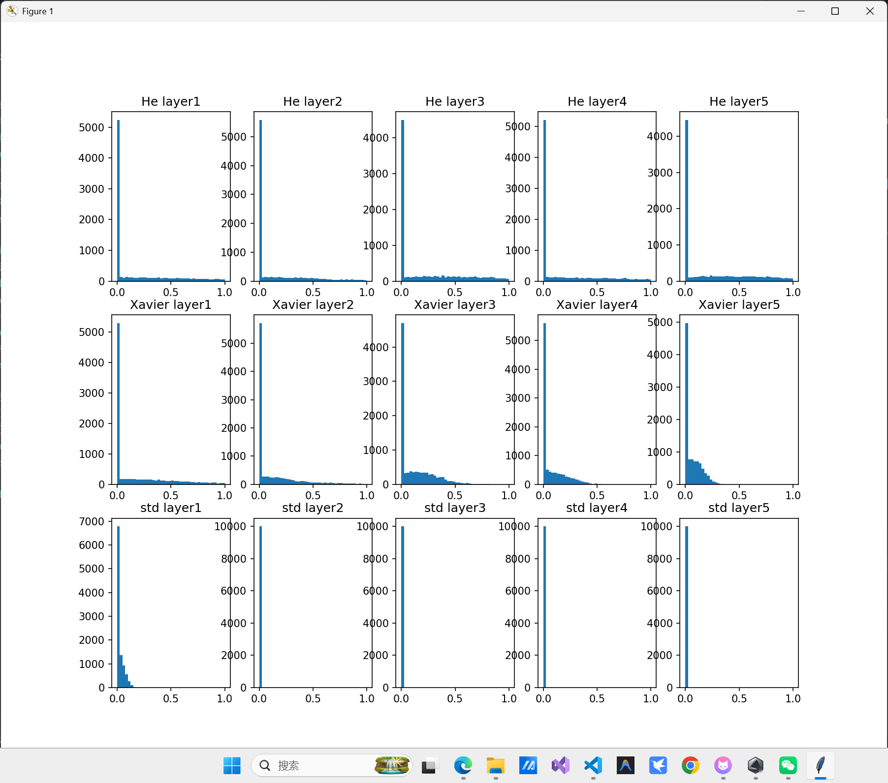
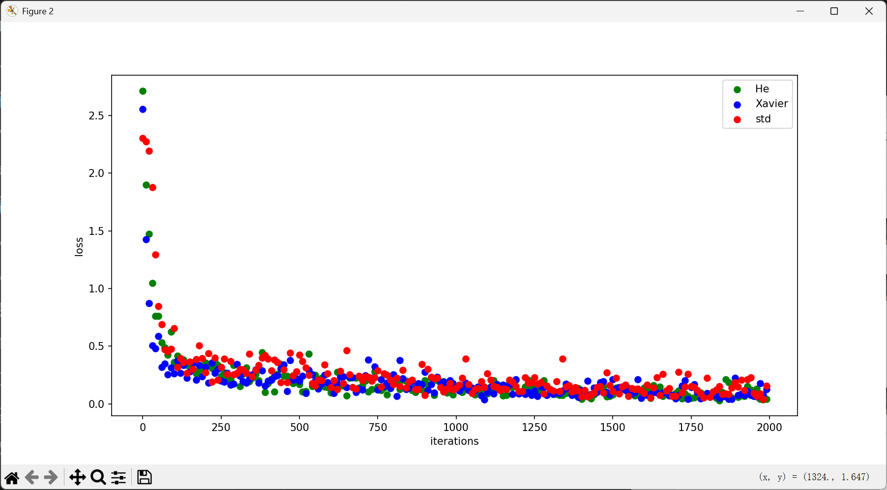
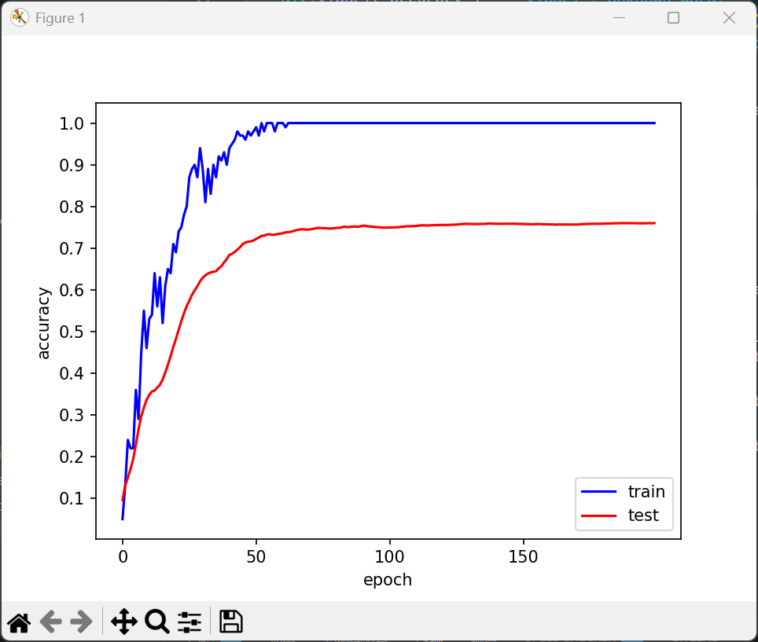
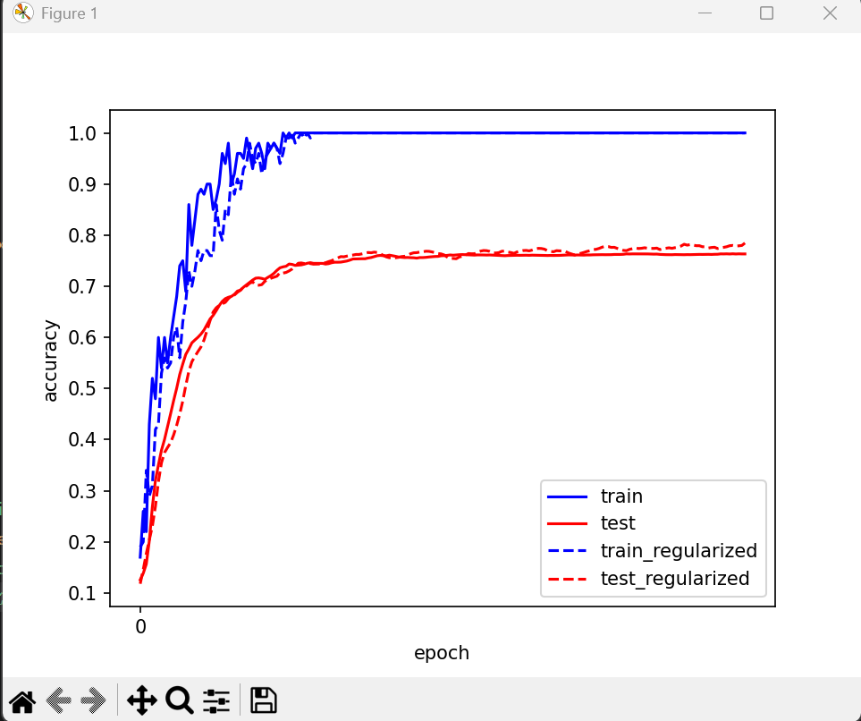

# 第六章 与学习相关的技巧

本目录对应《深度学习入门》中“与学习相关的技巧”一章，重点不是再发明新的网络结构，而是研究如何让已有网络学得更快、更稳、更不容易过拟合。本章围绕优化器、权重初始化、Batch Normalization、权值衰减与 Dropout 展开实验。

本章对应的主要代码如下：

- `ch1参数更新.py`：实现 `SGD`、`Momentum`、`AdaGrad`、`Adam` 并比较训练损失。
- `ch2权重初始值问题(sigmoid).py`：观察 sigmoid 网络在不同权重尺度下的激活分布。
- `ch3权重初始值问题(relu).py`：观察 ReLU 网络在不同初始化方式下的激活分布与训练损失。
- `ch4Batch_Nomalization.py`：实现 Batch Normalization 的前向、测试前向和反向传播。
- `自定义神经网络.py`：构造多层全连接网络，并加入权值衰减相关损失与梯度逻辑。
- `ch5过拟合以及正则化.py`：对比无正则化与权值衰减条件下的训练现象。
- `ch6Dropout.py`：实现 Dropout 层。

## ch1 参数更新

### 实验目的

比较不同优化器在相同任务上的收敛速度与稳定性，理解“参数如何更新”会直接影响学习效率。

### 实验原理

神经网络训练的目标是最小化损失函数，不同优化器的主要区别在于：如何利用当前梯度、历史梯度及梯度平方信息来决定更新方向和更新步长。

#### 1. SGD

更新公式：

`W <- W - lr * dW`

特点是实现简单，但只依赖当前梯度，容易在狭长谷底中来回震荡。

#### 2. Momentum

在 SGD 基础上引入速度变量 `v`。如果某一方向梯度长期一致，速度会不断累积，从而加快收敛；若某一方向来回振荡，动量会帮助平滑更新。

#### 3. AdaGrad

为每个参数维护历史梯度平方和 `h`，根据 `1 / sqrt(h)` 自适应缩放学习率。梯度大的参数后续学习率会减小，适合稀疏特征场景。

#### 4. Adam

结合一阶动量和二阶动量，同时利用方向信息与尺度信息。通常在入门实验中表现较稳定，调参成本也较低。

### 实验结果

### 实验现象及原因分析

- `Adam` 一般下降最快，较早进入低损失区域。
- `Momentum` 相比普通 `SGD` 更稳定，说明历史方向有助于抑制震荡。
- `AdaGrad` 前期收敛往往较快，但后期学习率会逐渐变小。
- `SGD` 最依赖学习率设置，如果学习率不合适，容易下降慢或出现明显振荡。

### 什么时候用，以达到什么效果

- `SGD`
  适合做基础对照实验，或在后期希望控制更新更“纯粹”的场景。
  达到的效果是实现简单、含义直观，但通常收敛较慢。

- `Momentum`
  适合损失曲面不平滑、普通 SGD 震荡明显的情况。
  达到的效果是让下降更平稳，通常比 SGD 收敛更快。

- `AdaGrad`
  适合稀疏特征或希望不同参数使用不同学习率的情况。
  达到的效果是前期收敛较快，但长时间训练中学习率可能衰减过度。

- `Adam`
  适合大多数入门实验和一般场景。
  达到的效果通常是收敛快、训练稳定、调参更省心。

## ch2 权重初始值问题：sigmoid

### 实验目的

观察在 sigmoid 激活函数下，不同权重尺度会怎样影响各层激活值分布，并理解梯度消失为何发生。

### 实验原理

sigmoid 会把输入压缩到 `(0, 1)` 区间。当输入绝对值很大时，输出接近 `0` 或 `1`，函数进入饱和区，导数很小，梯度会在反向传播中迅速衰减。

因此：

- 权重过大：`Wx` 幅值过大，激活值集中到两端，进入饱和区。
- 权重过小：激活值集中在中间狭小区域，层与层间信息不断被压缩。

Xavier 初始化的思想，就是尽量保持各层前向传播时的方差稳定，使 sigmoid 网络不至于一开始就陷入饱和或塌缩。

### 实验结果

### 实验现象及原因分析

- 权重较大时，激活值逐层集中到 `0` 和 `1` 附近，说明网络大量进入饱和区。
- 权重过小时，激活值集中在 `0.5` 左右，区分度不足。
- 调整到合适尺度后，各层激活值分布更均匀，更有利于信号与梯度传播。

### 什么时候用，以达到什么效果

- 若隐藏层仍使用 sigmoid 或 tanh，应特别重视初始化尺度。
- 目标是避免激活函数过早进入饱和区，减少梯度消失。
- 实践中常用 Xavier 初始化来达到这一效果。

## ch3 权重初始值问题：ReLU

### 实验目的

比较 `std=0.01`、`Xavier` 和 `He` 三种初始化方式在 ReLU 网络中的表现。

### 实验原理

ReLU 定义为：

`relu(x) = max(0, x)`

它在正半轴保持线性，在负半轴直接截断为 0。  
若输入分布不合适，就可能出现：

- 输出普遍过小，信号变弱
- 大量神经元长期处于 0 区域，形成“死亡 ReLU”

He 初始化使用 `sqrt(2 / n)` 作为标准差，目的是让 ReLU 网络在前向传播时保持较稳定的方差。

### 实验结果

### 实验现象及原因分析

- `std=0.01` 时，激活值大量贴近 0，损失下降最慢。
- `Xavier` 相比 `std=0.01` 更好，但对 ReLU 不如 He 匹配。
- `He` 初始化的激活分布最自然，训练损失下降也最快。

### 什么时候用，以达到什么效果

- 当隐藏层使用 ReLU 或其变体时，优先使用 He 初始化。
- 目标是维持信号方差、减少神经元失活、提高训练效率。

## ch4 Batch Normalization

### 实验目的

实现 Batch Normalization，并理解它为什么能让训练更稳定。

### 实验原理

Batch Normalization 在 mini-batch 内做以下操作：

1. 计算均值
2. 计算方差
3. 将输入标准化
4. 再通过 `gamma`、`beta` 做线性恢复

训练阶段使用当前 batch 的统计量，测试阶段使用滑动平均得到的 `running_mean` 和 `running_var`。

### 现象及原因分析

Batch Normalization 的典型效果包括：

- 训练更稳定
- 对初始化不那么敏感
- 往往可以使用更大的学习率
- 收敛更快
- 有时会附带轻微正则化效果

### 什么时候用，以达到什么效果

BN 特别适合以下场景：

- 网络较深，训练不稳定
- 梯度容易震荡
- 对初始化较敏感
- 想提高收敛速度

达到的效果通常是：

- 稳定中间层分布
- 减少训练过程中的分布漂移
- 让优化更容易进行

### 使用时的注意点

- BN 一般放在线性层或卷积层之后、激活函数之前，即常见顺序为：
  `Affine/Conv -> BN -> ReLU`
- batch 很小时，BN 的统计量可能不稳定，效果会变差。
- 测试阶段必须使用训练中积累的滑动均值和方差，而不能继续直接用当前 batch 的统计量。

## ch5 过拟合与正则化

### 过拟合的基本概念

过拟合指的是模型在训练集上表现很好，但在测试集上的泛化能力不足。常见成因包括：

- 模型太复杂
- 数据太少
- 训练时间过长

### 实验设置

当前实验使用多层全连接网络，在 MNIST 前 `300` 个样本上训练，故意构造“模型容量较强但训练数据较少”的场景，以更容易观察过拟合。

### 实验结果

### 实验现象及原因分析

- 训练准确率迅速接近 `1.0`
- 测试准确率明显低于训练准确率

说明模型已经在一定程度上记住了训练集，而没有真正学到能泛化到新样本的规律。

### 权值衰减的原理

L2 正则化在数据损失上额外加一项：

`L_total = L_data + (lambda / 2) * sum(||W_i||^2)`

反向传播时，每层权重梯度变成：

`dW = dW_data + lambda * W`

它的本质是在惩罚过大的权重，使模型倾向于学习更平滑、更不极端的参数。

### 权值衰减实验结果

### 实验现象及原因分析

- 加入权值衰减后，训练准确率上升会更慢。
- 测试准确率有时会更平稳，但在当前参数设置下不一定明显超过无正则化结果。

这通常意味着：

- 正则项确实在生效
- 但当前 `lambda`、训练轮数或数据量设置下，模型有可能被约束得偏保守

### 什么时候用，以达到什么效果

权值衰减适合：

- 明显存在过拟合
- 权重容易变得很大
- 想让模型更平滑、更稳健

达到的效果是：

- 抑制权重无限增大
- 降低模型复杂度
- 减轻过拟合风险

若发现训练和测试都变差，常见原因是正则强度过大，导致欠拟合。

## ch6 Dropout

### Dropout 的原理

Dropout 不是激活函数，也不是替代主干网络层的结构。  
它是插入到网络中的一个正则化层，训练时随机让一部分神经元输出变为 0。

在当前实现中：

- 训练阶段生成随机 `mask`
- 前向传播执行 `out = x * mask`
- 测试阶段执行期望缩放 `out = x * (1 - dropout_ratio)`
- 反向传播执行 `dx = dout * mask`

### 它为什么有效

Dropout 的关键作用是防止神经元之间形成过强的“共适应”关系。  
每次训练都随机屏蔽一部分神经元，相当于让网络在很多不同的子网络上共享参数训练，因此模型更不容易死记硬背训练集。

### 它和权值衰减的区别

- 权值衰减关注的是：不要让权重值过大
- Dropout 关注的是：不要让模型过度依赖某些固定神经元路径

两者都能缓解过拟合，但作用机制不同。

### 它应该放在什么位置

常见形式为：

`Affine -> ReLU -> Dropout -> Affine -> ReLU -> Dropout -> ...`

也就是说，它通常加在隐藏层之后，尤其常见于全连接层后。

### 什么时候用，以达到什么效果

Dropout 适合：

- 模型较大、参数较多
- 数据相对较少
- 已经观察到明显过拟合
- 全连接层较多

达到的效果通常是：

- 降低训练集记忆倾向
- 提高泛化能力
- 让模型学到更稳健的表示

### 使用时的注意点

- Dropout 不是每层都必须加，加太多反而容易欠拟合。
- 卷积网络前几层通常更谨慎使用 Dropout，或使用更小丢弃率。
- 若训练变得明显过慢、训练准确率和测试准确率都偏低，通常意味着 Dropout 太强。

## 几种技巧如何配合使用

在真实训练中，这些技巧常常不是单独使用，而是组合出现：

- `He 初始化 + ReLU`
  这是非常经典的搭配，用于保证前向传播时信号方差稳定。

- `Batch Normalization + 较大学习率`
  BN 往往让训练更稳定，因此常常允许使用更积极的学习率设置。

- `权值衰减 + Dropout`
  两者都可缓解过拟合，但作用机制不同。前者限制权重大小，后者限制神经元共适应。

- `Adam + 合理初始化`
  Adam 会帮助优化更快收敛，但它并不能替代好的初始化。

## 方法选用指南

为了便于复习，可以把本章技巧粗略总结为：

- 训练太慢：先看优化器和初始化，必要时考虑 BN
- 训练不稳定、对初值敏感：优先考虑 BN 和更合适的初始化
- 训练集准确率很高、测试集明显偏低：优先考虑权值衰减和 Dropout
- ReLU 网络：优先考虑 He 初始化
- sigmoid / tanh 网络：优先考虑 Xavier 初始化
- batch 很小：使用 BN 时要特别谨慎

## 本章总结

第六章讨论的不是“新的网络结构”，而是“怎样让已有网络学得更好”：

- 优化器决定参数更新方式，影响收敛速度与稳定性
- 合理初始化决定信号能否在深层网络中顺利传播
- Batch Normalization 通过稳定中间分布让训练更容易
- 权值衰减和 Dropout 都用于缓解过拟合，但作用机制不同

把这些技巧和误差反向传播结合起来，才构成了一个真正可训练、可扩展的神经网络系统。
